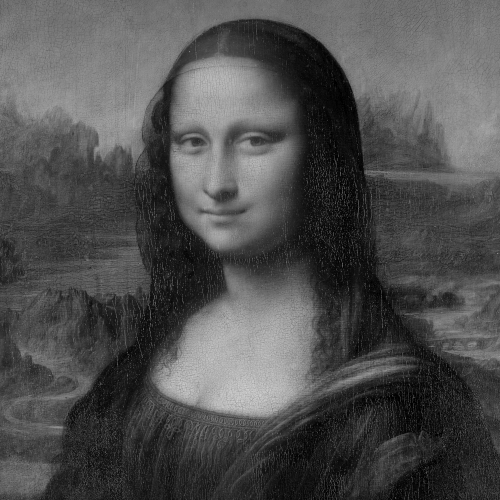

# Univariate Syntetic Experiment: Learning the Mona Lisa

The file `run.sh` contains reference commands to reproduce the experiments presented in the paper. Results are evaluated/plotted in the files `plot.ipynb`.

The file `mona.png` is a cutout of the following Public Domain image:
[https://commons.wikimedia.org/wiki/File:Mona_Lisa,_by_Leonardo_da_Vinci,_from_C2RMF_retouched.jpg](https://commons.wikimedia.org/wiki/File:Mona_Lisa,_by_Leonardo_da_Vinci,_from_C2RMF_retouched.jpg)

