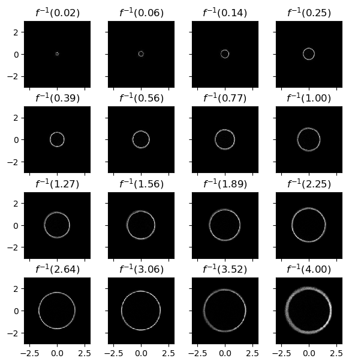
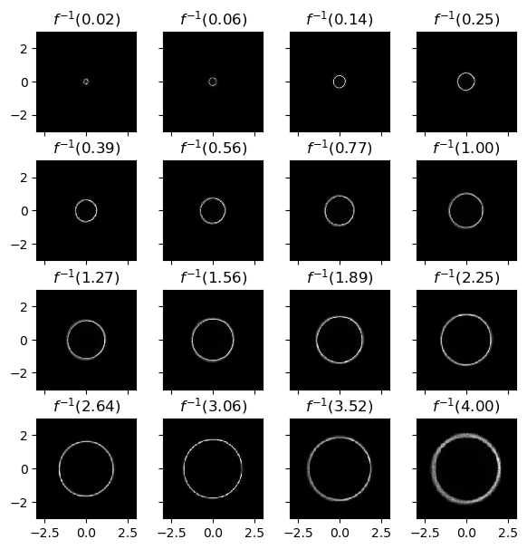

# Multivariate experments

The file `run.sh` contains reference commands to reproduce the experiments presented in the paper. Results are evaluated/plotted in the files `plot_mnist.ipynb` and `plot_paraboloid.ipynb`.

## Paraboloid plots

### MDN10

### MDN100

### CRPS

### WCRPS

## MNIST

